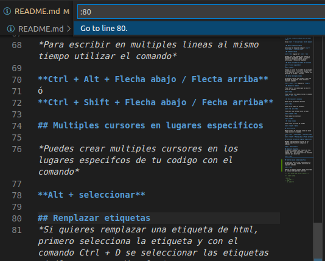
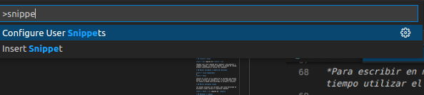
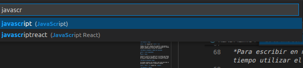
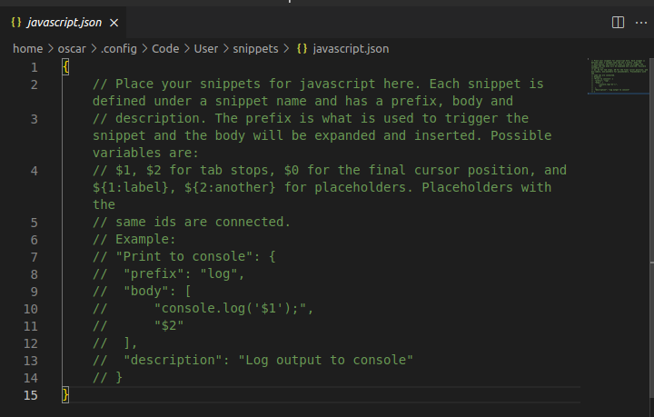
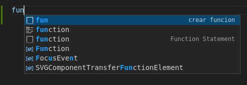
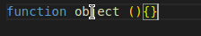

#  ATAJOS DE TECLADO VCODE

 * ## Mover lineas de codigo hacia arriba o abajo

teclas **alt  + fecla arriba o felcha abajo**


* ## Mover bloques de codigo 

seleccionar el bloque de codigo + **ALT + flecha abajo o flecha arriba**

* ## Comentar codigo

**Ctrl + K** seguido de + **Ctrl + C**

*Puedes usar este comando para comentar y descomentar o comentar codigo, si quieres comentar un bloque de código, primero seleccionala y teclea los comandos*

* ## Buscar variables o nombre de funciones

**Ctrl + click izquierdo**
ó
**Ctrl + F12**

*Coloca el cursor en el nombre de la variable que deseas buscar y teclea los comando Ctrl + click izquierdo, esto te llevara a donde esta declarada tu varible o función*

* ## Borrar multiples lineas

*Si deseas eliminar una variable, pero esta declarada en multiples lineas teclea el siquiente comando*

**Ctrl + Shift + L** seguido de  **Supr**

* ## Deshacer y rehacer

*Para revertir los cambios que has escrito teclea el comando*

**Ctrl + Z**

*Para regresar los cambios teclea el comando*
**Shift + Ctrl + Z**


* ## Movernos entre ventanas

*Para cerrar una pestaña abierta*

**Ctrl + W**

*Para cerrar todas las ventanas*

**Ctrl + K  Ctrl + W**

*Para abrir una ventana recien cerrada*

**Ctrl + Shift + T**

*Para cambiar de ventanas*

**Ctrl + TAB**

* ## Clonar lineas

*Para clonar una linea de codigo*

**Ctrl + Shift + Alt**

## Multi cursores

*Para escribir en multiples lineas al mismo tiempo utilizar el comando*

**Ctrl + Alt + Flecha abajo / Flecta arriba**
ó
**Ctrl + Shift + Flecha abajo / Fecha arriba**

## Multiples cursores en lugares especificos

*Puedes crear multiples cursores en los lugares especifcos de tu codigo con el comando*

**Alt + seleccionar**

## Renplazar etiquetas
*Si quieres remplazar una etiqueta de html, primero selecciona la etiqueta y con el comando Ctrl + D se seleccionar las etiquetas similares para editarlas*

**Ctrl + D**


## Movernos a una liena especifica

*Si queremos mover en una linea especifica del documento, solo tenemos que teclear el siguiente comando*

**Ctrl + G**

*Abrira una pequeña ventana donde colocaremos la linea a donde queremos movernos*



## Snippets básicos

*Para crear un snippets tecleamos el comando*

**Ctrl Shift + P**

*Nos mostrara la siguiente ventana y escribimos*



*Seleccionamos la primera opción que es Configure User Snippets, cambiara nuestra ventana*



*Escribimos el lenguaje de programación de la que queremos crear el snippets y la seleccionamos*

*Nos mostrara un ejemplo de como podemos crear nuestro snippets*



*Vamos a crear un snippets que nos cree una función debajo de nuestro ejemplo*

```json
{
    //Nombre para identificarlo
	"crear funcion":{
		//abreviatura para llamar a nuestro snippet
		"prefix": "fun",

		//Lo que vamos a crear con nuestro snippet
		"body": [
			"function object () {}"
		],
		//Descripción de lo que hace nuestro snippets
		"description": "Crea una función en javascript"


	}
}
```

*Para ocupar nuestro snippets nos vamos a un documento de javascript y escribimos solo la abreviatura del snippet*



*Al escribir la abreviatura de nuestro snippets ya nos muestra una sugerencia que es el snippets que creamos y viene con una pequeña descripción que colocamos, solo damos TAB para terminar*



*Y tenemos nuestra función creada, esto lo podemos realizar con codigo que regularmente utilizamos para hacer la tarea mas facil*

## Otros comandos de ayuda

*Normalmente el nuestro codigo se muestra en una sola linea y aveces sale fuera de nuestra pantalla, para que nuestro codigo haga un salto de linea y pueda verse en toda la pantalla ocupamos el comando*

## Snippets personalizados

*Tenemos opciones que nos ayudaran a personalizar nuestros snippets y darles un mejor formato, como el siguiente ejemplo*

```json
{
    "crear funcion":{
		"prefix": "fun",
		"body": [
			"function ${1:object} ($2){",
			"",
			"}$3"
		],
		"description": "Crea una función en javascript"


	}
}
```
*Tenemos las siguientes opciones*

*EL 1 indica el primer TAB y lo que hace es pocisionar el cursos sobre el elemento para poder cambiarle de nombre*

* $1{1:label}

*La siguiente opción es la posición donde se va a colocar nuestro segundo TAB*
* $2

**Alt + Z**

*Si queremos que nuestro codigo se siga mostrando en una sola linea, ocupamos el mismo comando para cambiar la vista*
<!-- Para tachar una letra ~~texto~~ -->

<!-- crear listas

* Item 1
    * item 1.1
1. item 1
    1. item -->    